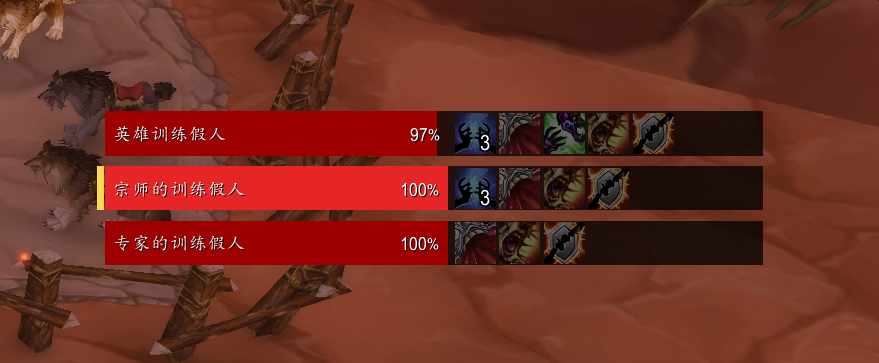
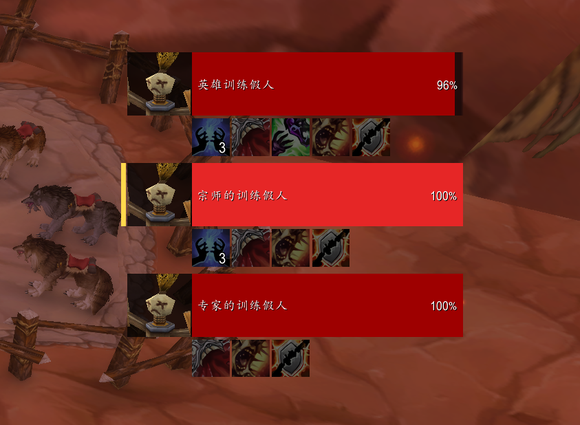
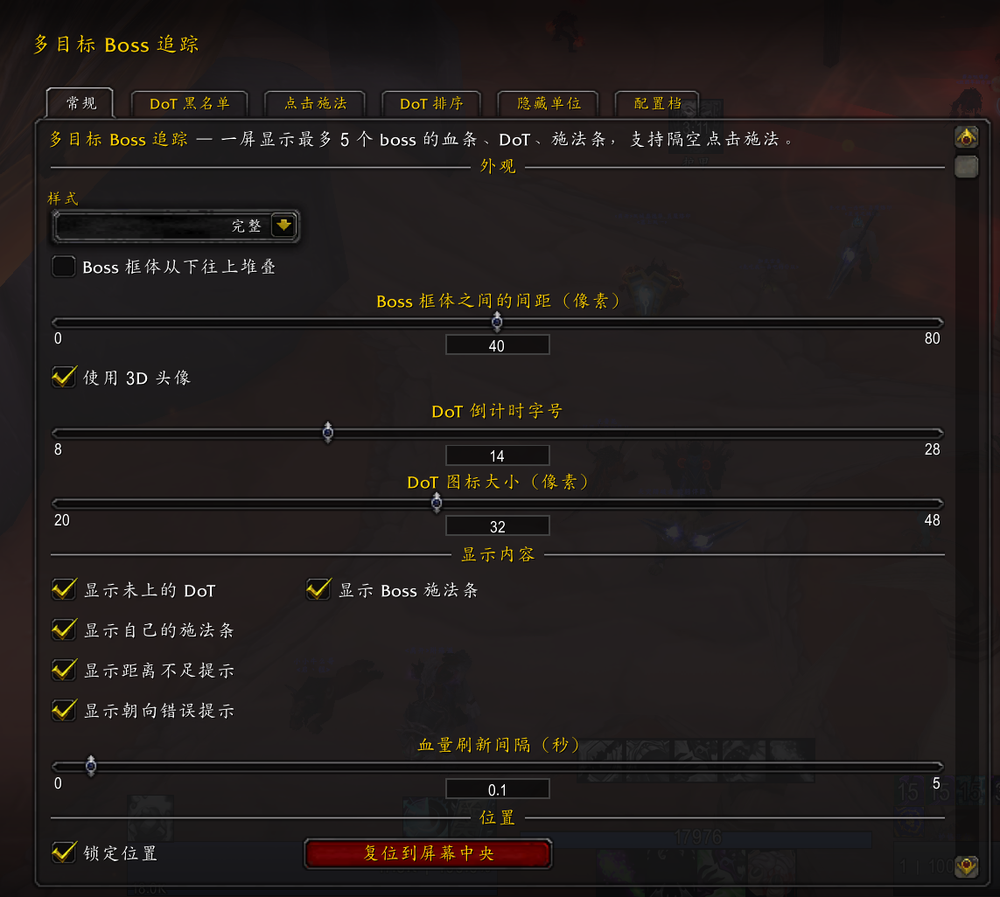
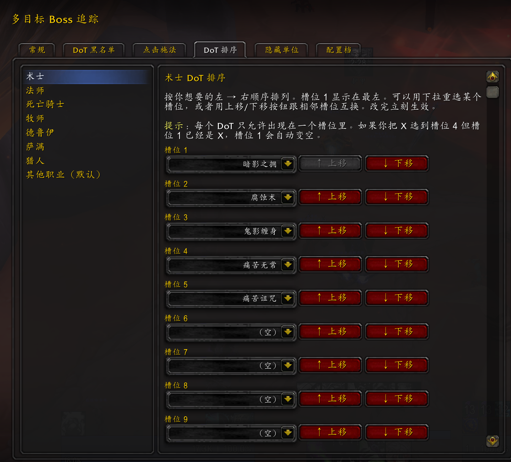
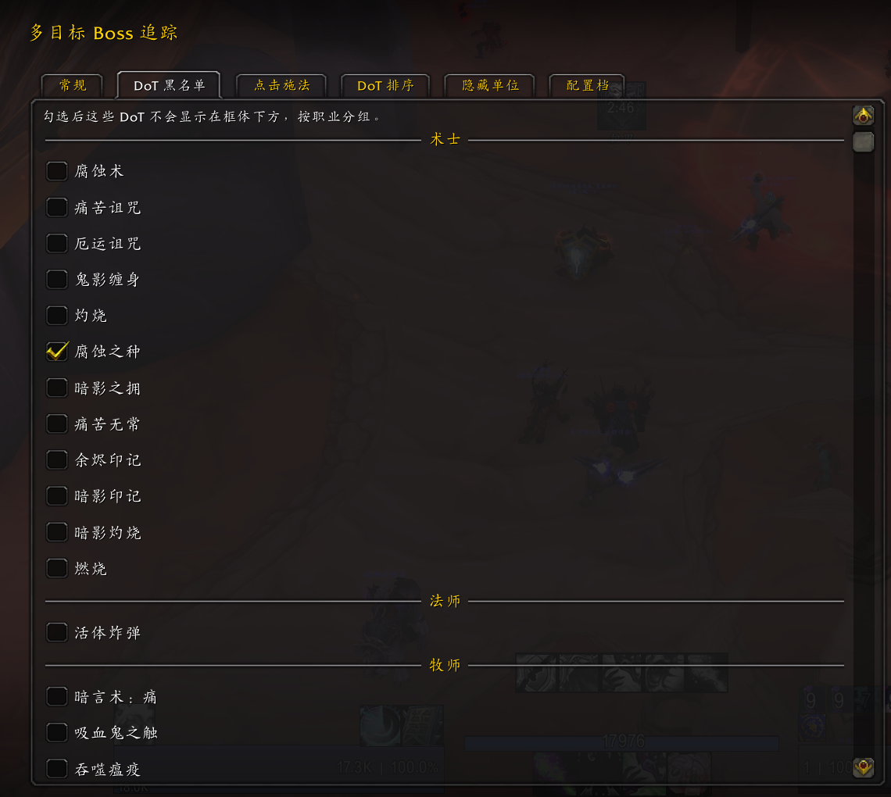
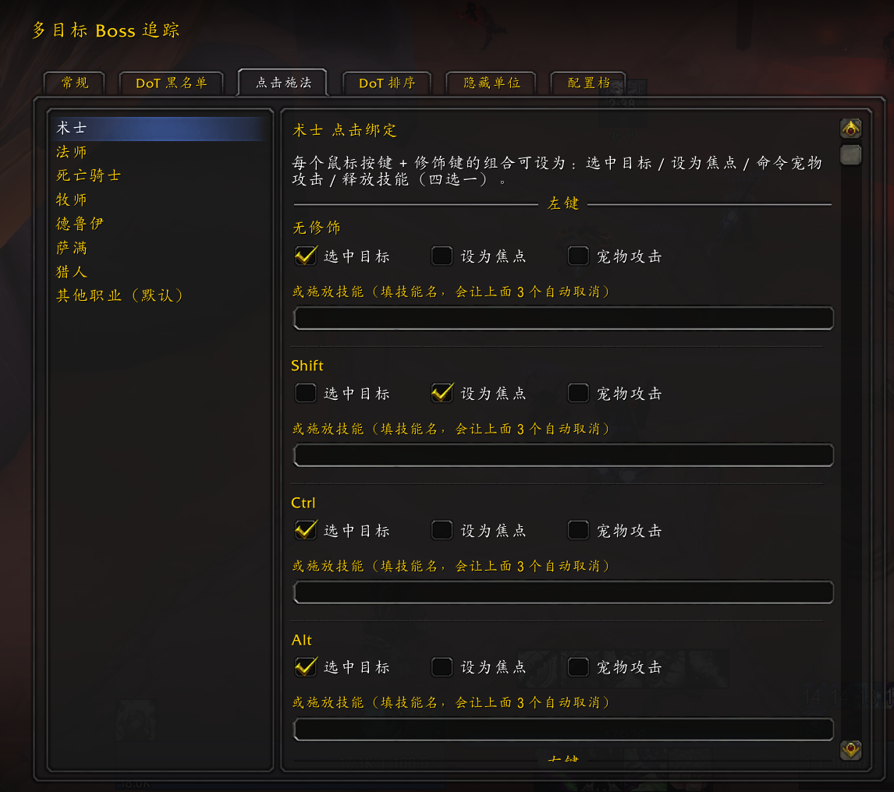
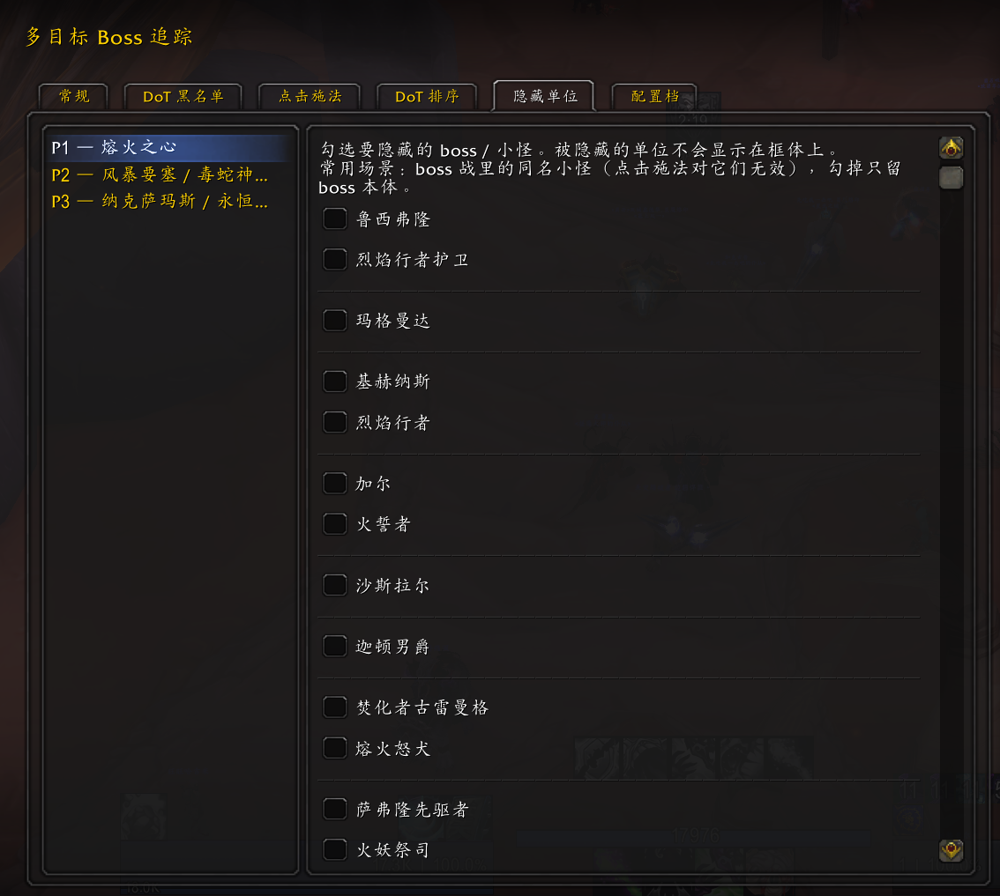
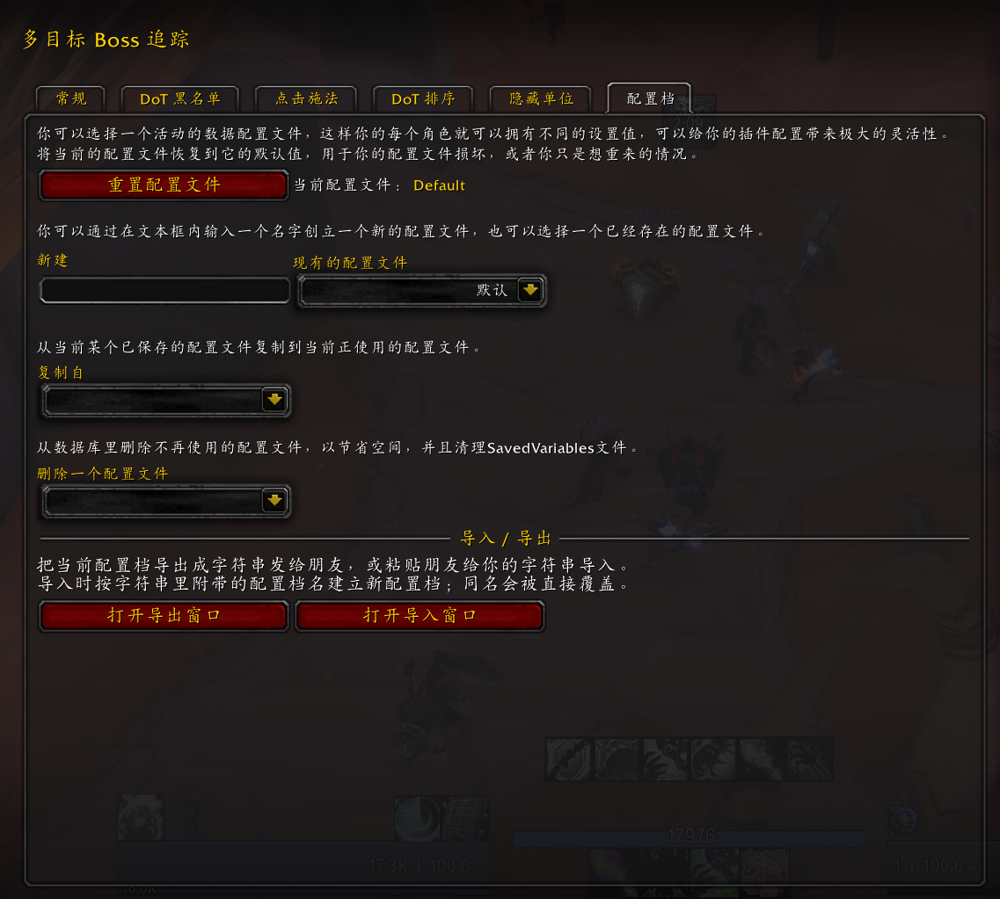

# 多目标 Boss 追踪 (MultiBossTracker)

一屏同时显示最多 5 个 boss 的状态，支持隔空点击施法。专为多 dot / 多目标战斗设计的 WoW 插件，运行在 MoP Classic 5.5（中国官服 / 泰坦怀旧时光）。

## 界面预览

| 极简 | 标准 |
|---|---|
|  |  |
| 单条窄血条 + 右侧 DoT，最省空间 | 头像 + 血条 + 施法条 + 下方 DoT 行 |

▶ 动画演示：[极简模式](assets/minimal.gif) · [标准模式](assets/standard.gif)

## 功能

### 核心
- 进入副本/主城自动识别区域，最多显示 5 个 boss 框体（A/B/C/D/E）
- 每个框体显示：boss 实时 3D 模型（可切换 2D 头像）、HP 条、Boss 施法条、玩家施法条、DoT 图标行
- **点击框体即可对那只 boss 释放任意技能而不切走当前目标**（左键 / 右键 / 中键 / 侧键 4 / 侧键 5 + Shift / Ctrl / Alt 修饰，每职业 20 个绑定槽）
- DoT 图标 / 持续时间 / 层数都从 `UnitDebuff` 实时读取
- 当前 target 的框体高亮（HP 变亮 + 左侧金色竖条）

### 视觉提示
- **玩家自己的施法条** —— 顶部 4px 青条，多目标切换时一眼定位"当前 cast 在哪只 boss 上"
- **超出范围 / 面对目标** —— HP 内嵌右上角鲜黄文字提示，距离用 `IsSpellInRange`（自动跟天赋/雕文加成），朝向通过 `UI_ERROR_MESSAGE` 反应式捕捉
- **团长设置的团标** —— 星星 / 圈圈 / 菱形等标记叠在 boss 头像左上角（紧凑模式下贴在 target 黄竖线左侧），监听 `RAID_TARGET_UPDATE` 实时刷新
- **术士印记 combo glow** —— 单印记 6 层 → DoT 图标金色旋转火花；双印记同时 6 层 → 整框周长流动光圈（终结技信号）
- 满层提示由 [LibCustomGlow](https://github.com/Stanzilla/LibCustomGlow) 驱动，未来易扩展（pandemic 警告 / 低血提示 / cast target 高亮等）

### 自定义
- 极简 / 标准两种外观可切换
- 拖拽位置（多配置档独立保存）
- DoT 图标大小（16-48px）/ 倒计时字号 / 行间距 滑动调节（DoT 大小驱动整框尺寸）
- DoT 排序（每职业独立）+ DoT 黑名单（按需屏蔽）+ 隐藏单位（按副本阶段组织）
- 血量刷新间隔（默认 0.1 秒，DPS 关键判断）
- 各类显示开关：3D/2D 头像、Boss 施法条、玩家施法条、距离 / 朝向提示、团标、未上的 DoT 占位、小地图按钮

## 设置面板预览

| 总设置 | DoT 排序 |
|---|---|
|  |  |
| 外观 / 显示 / 位置等通用选项 | 每职业独立的 DoT 左右顺序 |

| DoT 黑名单 | 点击施法 |
|---|---|
|  |  |
| 屏蔽不想看的 DoT，按职业分组 | 鼠标按键 + 修饰键自由绑定 |

| 隐藏单位 | 配置保存与分享 |
|---|---|
|  |  |
| 按副本阶段勾选要隐藏的 boss / 小怪 | 配置档导出成字符串发给朋友 |

## 目录结构

```
MultiBossTracker/
├── MultiBossTracker.toc      # 插件清单
├── Core.lua                  # 入口 + AceDB + 事件总线
├── ClickCast.lua             # SecureActionButton 宏生成
├── Locale/                   # 中文本地化
├── Data/
│   ├── Classes/              # 各职业 DoT / 伤害咒语数据
│   └── Zones/                # 各副本 boss NPCID 数据库 (T1-T10)
├── Dispatchers/              # 事件派发层
│   ├── ZoneDispatcher.lua    # 区域 / 遭遇战切换
│   ├── DotDispatcher.lua     # CLEU → DoT 路由
│   ├── CastDispatcher.lua    # NPC 施法监听
│   └── HealthUpdater.lua     # raid 扫描取血量
├── Frames/                   # 框体 UI
├── Options/                  # 设置面板 (AceConfig)
└── Libs/                     # Ace3 依赖
```

## 斜杠命令

```
/mbt                  打开设置面板
/mbt where            显示当前区域和目标的 NPCID（用于排查）
/mbt showmacro [A-E]  打印某个框体的点击施法宏
/mbt lock             锁定框体位置
/mbt unlock           解锁拖动
/mbt reset            复位到屏幕中央
```

## 技术备注

- **客户端适配**：MoP Classic 5.5（TOC 50503）。安全按钮使用 `SecureActionButtonTemplate` + `BackdropTemplate`。
- **DoT 时长精度**：CLEU 触发时优先 `UnitDebuff` 读取真实 duration / expirationTime；找不到 unit token 时回退用 `UnitSpellHaste` 计算估算时长。
- **本地化**：内部数据用英文 key，运行时翻译为中文匹配 `GetSubZoneText()` 返回值。
- **事件总线**：自实现的 `MBT:FireEvent` / `MBT:RegisterMDFEvent` pub/sub。

## 第三方库

`Libs/` 下包含的所有第三方依赖，均通过 LibStub 加载：

| 库 | 用途 | 来源 |
|---|---|---|
| Ace3 全套（AceAddon / AceConfig / AceDB / AceEvent / AceTimer / AceConsole / AceGUI / AceDBOptions / CallbackHandler / LibStub）| 插件框架 | https://www.wowace.com/projects/ace3 |
| LibDataBroker-1.1 / LibDBIcon-1.0 | 小地图按钮 | https://github.com/tekkub/libdatabroker-1-1 |
| **LibCustomGlow-1.0** | 4 种风格的 glow 特效（PixelGlow / AutoCastGlow / ButtonGlow / ProcGlow），WeakAuras / ElvUI 同款 | https://github.com/Stanzilla/LibCustomGlow |

LibCustomGlow 调用方式（LCG = `LibStub("LibCustomGlow-1.0")`）：

```lua
LCG.AutoCastGlow_Start(frame, {r,g,b,a}, N, frequency, scale, xOff, yOff, key)
LCG.AutoCastGlow_Stop(frame, key)

LCG.PixelGlow_Start(frame, color, N, frequency, length, thickness, xOff, yOff, border, key)
LCG.ButtonGlow_Start(frame, color, frequency)
LCG.ProcGlow_Start(frame, options)
```

库本身要求 Legion+ 的 `CreateTexturePool` / `CreateFramePool` API；MoP 客户端没有这俩，
所以在 `Libs/LibCustomGlow-1.0/Compat.lua` 里写了个 polyfill 顶住，**不修改 lib 本体**。
将来升级 lib 直接覆盖 `LibCustomGlow-1.0.lua` 即可。
